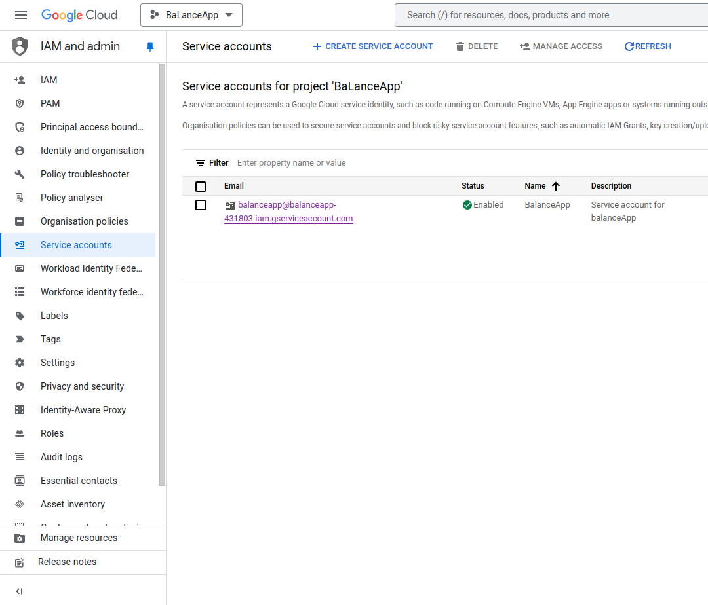
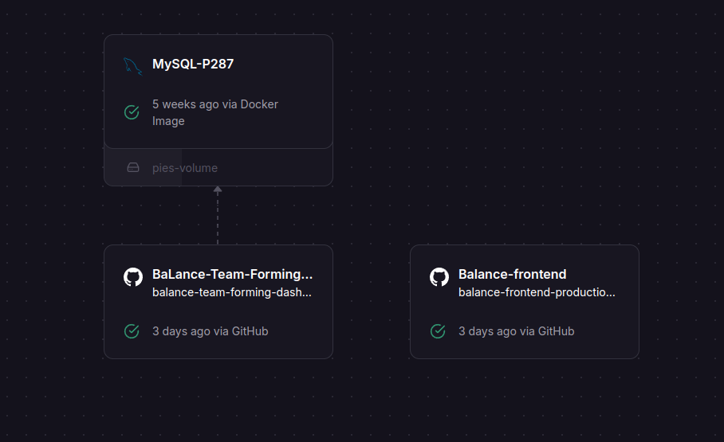

# BaLance - Team Forming Dashboard

BaLance is a tool for teaching associates to split student cohorts into well Balanced teams that gel well together
and work productively.

It makes use of student personality data to determine the optimal team formations and provides a variety of team
formation strategies for teaching associates to select from.

The application offers three methods for forming teams:

1. **Belbin Personality Method**: This method categorizes students by Belbin team roles, where student are categorised as either people, thinking or action.

2. **Effort-Based Method**: This approach assesses the hours students are willing to commit to group work, pairing student together with same work ethics.

3. **Project Preference Method**: This strategy lets students indicate their project preferences with submission time serving a first come first serve basis.

These strategies allow teachers to select the most suitable approach based on their unique cohort dynamics, ultimately enhancing the learning experience for students.

# Table of Contents

1. [Software Requirements](#Software-Requirements)
   - [Dependencies](#Dependencies)
   - [External Dependencies](#external-dependencies)
2. [Setup Guide](#Setup-Guide)
   - [Installation](#installation)
   - [Setup](#setup)
3. [Deployment](#Deployment)
4. [Git Quality Assurance](#Git-Quality-Assurance)
   - [Versioning Strategy](#versioning-strategy)
   - [Pull Requests](#pull-requests)
5. [Features](#features)
   - [Walkthrough](#walkthrough)
   - [CSV data format](#csv-data-format)
6. [Development guidelines](#development-guidelines)
7. [Contributors](#contributors)

# Software Requirements

## Dependencies

MERN architecture:

- MySQL Ver 8.1x(database)
- Express.js (backend)
- React Ver 18.x (frontend)
- Node.js (runtime)
- Docker (containerisation)

## External dependencies

- Auth0 (Authentication)
- Railway (deployment)
- Google Service accoutn (API functionality with service account)
- Google forms API
- Nodemailer

# Setup Guide

## Installation

- MySQL: Download Youtube guide: https://www.youtube.com/watch?v=u96rVINbAUI&feature=youtu.be \
  NOTE: When setting up your root account and password, be sure to keep them somewhere as it will be important in setting up the app workbench connection. Forgetting may require you to reinstall MySQL or may completely bar you from being able to set up the application.
- Docker: [Windows] (https://docs.docker.com/desktop/install/windows-install/) [Mac] (https://docs.docker.com/desktop/install/mac-install/). If on mac or linux[debian] you could use terminal

  ```
  brew install docker
  sudo apt install docker.io
  ```

- Node.js Download the Node.js installer from Node.js — Download Node.js® and run it.

## Setup

- Clone the repo:
  ```
  git clone https://github.com/Monash-FIT3170/BaLance-Team-Forming-Dashboard.git;
  cd BaLance-Team-Forming-Dashboard/
  ```
- MySQL
  1. Open up your MySQL workbench and create a new MySQL connection, using the default settings is fine.
  2. Create .env files in the frontend and backend folders in the below format. Change the DB_PASSWORD to your MySQL root account’s password. If you did not use root as your root account’s username, change DB_USER accordingly.
  3. Open the MySQL Terminal/ MySQL Shell and type in the following command:
     `source <absolute path>/schemaCreation.sql;`
     NOTE: if copying the path from vscode, explorer, etc. all back slashes ‘\’ must be replaced with forward slashes ‘/’
  4. Connect to your database:`mysql -h host_address -u user_name -p pass_word < schemaCreation.sql;`
- npm depencencies:
  ```
  cd backend
  npm i
  cd ../frontend
  npm i
  ```
- Google Service Account Creation:

  1. In the Google Cloud console, go to the Create service account page.
  2. Go to Create service account
  3. Select a Google Cloud project.
  4. Enter a service account name to display in the Google Cloud console.
  5. Done
  6. 
     To utilise the account you need to create a key:
  7. Click on the account, shown in the previous step
  8. Go to the keys tab
  9. Add key
     Note: This will download a json file. Store this in the backend env file as a string

- Auth0 Guide QuickStart : https://auth0.com/docs/quickstart/spa/react/interactive . Take note of the audience parameters

Run the frontend and backend from their respective directories

`cd backend; npm run start`
`cd frontend; npm run start`
Required environment variables:
In /backend/

```.dotenv
MYSQLPORT=
MYSQLHOST=
MYSQLUSER=
MYSQLPASSWORD=
MYSQL_DATABASE="student_group_db"
AUTH="TEST"
GOOGLE_SERVICE_ACCOUNT_TOKEN =
AUTH_DOMAIN=""
```

In /frontend/

```.dotenv
VITE_REACT_APP_AUTH="TEST"
VITE_REACT_APP_AUTH_CLIENT_ID=
VITE_REACT_AUTH_DOMAIN=
VITE_BACKEND_URL=""
```

Note: VITE BACKEND URL should be localhost:8080 if running on local or the backend public url if deployed

### Using docker

An existing docker-compose can be used however, it must be noted the database must be
run from your local device as an existing image has not yet been implemented.

# Deployment

This application was deployed on railway on their free tier: https://railway.app/ \
Quick guide on learning railway can be found here: https://docs.railway.app/quick-start \
Setting up BaLance:

1. Deploy from Github Repo (If you have linked your github account, you can find the Balance repo )
2. In the architecture view, click on the repo block
3. Under the Source, click on Add Root Directory. Set it to "/frontend" Change the "Branch connected to production" from main to deploymentBranch (optional). Generate domain (this will be the public url). Click out of the block
4. Top right, create -> Github Repo -> Balance
5. Under source, click Add Root Directory. Set it to "/backend" Change the "Branch connected to production" from main to deploymentBranch (optional). Click out of the block
6. Top right, create -> database -> mysql. This will create a mysql instance. (Note: if you would like specific version, you can click on the settings and change the source image to another docker image)
7. Next steps are to connect the backend to the database via variable references. Click on MySQL instance-> variables -> copy database, host, password, port, user variables and add them to the backend service. This is also where env file variables are added.
8. Add necessary env variables to both frontend and backend services \
    \
   Note: The deployed backend and frontend do not run the schema creation script. If needed to be run, it is recommended to connect to the online database via terminal. Command to so can be found by clicking on the mysql instance -> data tab -> connect ->public network. Can also perform the necessary changes via the railway UI.

# Git Quality Assurance

## Git Repository and Branching Model

The trunk based development branching model will be used in this project. This ensures that the main branch is always in development and the integration of features is continuous. This continuous integration allows for frequent code testing and reviews, promoting the quality of the code. Furthermore, continuous integration and frequent testing will help catch bugs early and reduce the risk of deploying a faulty product.
Commits

Developers are expected to regularly commit their progress. Commits should be small in size. Examples of acceptable commits are a complete function, or the framework for a class. In the case of large classes, every function within the class should be committed separately. When debugging code, developers should refrain from committing debugs in multiple sections of the code simultaneously. Each commit should only pertain to debugs of one function or a similarly small unit of code.

Commit descriptions should feature the following prefixes/tags: DEBUG, FEATURE, DOCS, REFACTOR, TEST, STYLE. The format of the commit should be ‘[prefix]: [description]’. Descriptions should be written in an imperative mood, using actionable verbs such as ‘add’, ‘update’, or ‘remove’. The description should be a single concise sentence. If your commit message needs to be longer, this indicates that it can be broken down into multiple commits.

## Branch

### Branching Rules

The main branch currently in github will function as the trunk branch with ‘feature’ branches as short development branches. Feature branches are branches where teams will develop, implement small tasks and features or perform code spikes all requiring no more than a few days' effort. After features are completed, a pull request (PR) shall be requested by the agile team with final code review and execution of CI/CD pipelines before merging into the main branch. (Complete CI/CD pipelines may not be applicable to certain, if not any, stages of the project as it is a requirement to be implemented).

### Branch Naming Convention

Branch names shall follow the following convention:
Type of Branch/Related User Stories/description of branch

Types of branches include:
Feature
Code Spike
Hotfix

Eg. Feature/User Story 1/Add Button

## Versioning strategy

Semantic Versioning (SemVer): Semantic Versioning uses a three-part version number: MAJOR.MINOR.PATCH. \
[MAJOR] Significant changes and versions are not backwards compatible \
[MINOR] New features and versions are backward compatible \
[PATCH] Bug fixes/ small changes. Remains backward compatible \

## Pull requests

Contributions are welcome and can be submitted via pull requests. \
All pull requests must include the following:

- A brief summary of the changes made.
- References to any relevant issue numbers (if applicable).
- Instructions for testing the changes.
- Any other relevant information (e.g., potential impacts on other parts of the codebase).
  A maintainer will be notified and review the changes made.

# Features

- Forms groups between students using one of multiple available formation strategies
- View group by group and cohort wide analytics on personality distribution
- Export group allocation data in CSV format for use with your learning management system
- Sending out a google forms to all students to collect results
- Auth0 login page preventing use of features without authentication
- Manual data entry, addition, editing or removal of data

## Walkthrough

1. To use the team forming dashboard, create a new offering for the unit you are currently running
2. Enter the unit and upload your csv list of students with their student details
3. Upload student personality data in accordance with the strategy you would like to form teams
   against
4. Select your group formation strategy and form groups
5. Optionally export group information as a csv to upload to your learning management system


## CSV data format

The following examples outline the expected structure and content of csv files. Note extra columns may be present
but will be ignored and only what is shown will be used by the application.

### Student data

| studentId | labCode     | lastName | preferredName | email                       | wam | gender |
| --------- | ----------- | -------- | ------------- | --------------------------- | --- | ------ |
| 12345678  | 01_DualMode | Jim      | White         | jwhi0001@student.monash.edu | 93  | M      |
| 28462818  | 02_OnCampus | Jemma    | Black         | jbla0001@student.monash.edu | 93  | F      |

- studentId must be an 8-digit number
- labCode must be prefixed by the number and '\_' minimally
- gender must be a single char

### Belbin data

Belbin type must be one of people, thinking or action

| studentId | belbinType |
| --------- | ---------- |
| 12345678  | people     |
| 28462818  | thinking   |
| 41161886  | action     |

### Effort data

hourCommitment is the estimated number of hours that a student expects to commit in a week

| studentId | hourCommitment | avgAssignmentMark |
| --------- | -------------- | ----------------- |
| 12345678  | 13             | 73                |
| 28462818  | 18             | 84                |

### Times and Preferences data

Preferences can be added to the end of the table as needed. Project Pref is a number from 1 to n, where n is the number of projects.

| timestamp          | studentId | full name   | email                       | Project Pref n |
| ------------------ | --------- | ----------- | --------------------------- | -------------- |
| 2/26/2024 20:00:39 | 12345678  | Jim White   | jwhi0001@student.monash.edu | 1              |
| 2/26/2024 20:00:39 | 28462818  | Jemma Black | jbla0001@student.monash.edu | 9              |

# Development guidelines

Refer to the [feature extention](/docs/contributorsGuide/DEVELOPMENT.md) writeup under docs/ for further details on how to add group formation strategies

### Mock data

For the purpose of testing, a script to generate mock input data can be found under `docs/mockInputs`.
Run the following commands under the `docs/mockInputs` directory to create a virtual environment and view details on usage:

```bash
python -m venv .venv
source .venv/bin/activate # .venv/Scripts/activate for Windows
pip install -r requirements.txt
python ./generator.py --help
```

<!-- ALL-CONTRIBUTORS-BADGE:START - Do not remove or modify this section -->

[](#contributors-)

<!-- ALL-CONTRIBUTORS-BADGE:END -->

## Contributors ✨

Thanks goes to these wonderful people ([emoji key](https://allcontributors.org/docs/en/emoji-key)):

<!-- ALL-CONTRIBUTORS-LIST:START - Do not remove or modify this section -->
<!-- prettier-ignore-start -->
<!-- markdownlint-disable -->
<table>
  <tbody>
    <tr>
      <td align="center" valign="top" width="14.28%"><a href="https://github.com/abigail-rose"><br /><sub><b>Abby</b></sub></a><br /><a href="https://github.com/Monash-FIT3170/BaLance-Team-Forming-Dashboard/commits?author=abigail-rose" title="Code">💻</a> <a href="#design-abigail-rose" title="Design">🎨</a> <a href="https://github.com/Monash-FIT3170/BaLance-Team-Forming-Dashboard/issues?q=author%3Aabigail-rose" title="Bug reports">🐛</a> <a href="https://github.com/Monash-FIT3170/BaLance-Team-Forming-Dashboard/pulls?q=is%3Apr+reviewed-by%3Aabigail-rose" title="Reviewed Pull Requests">👀</a></td>
      <td align="center" valign="top" width="14.28%"><a href="https://github.com/ahes0001"><br /><sub><b>ahes0001</b></sub></a><br /><a href="https://github.com/Monash-FIT3170/BaLance-Team-Forming-Dashboard/commits?author=ahes0001" title="Code">💻</a> <a href="#design-ahes0001" title="Design">🎨</a> <a href="https://github.com/Monash-FIT3170/BaLance-Team-Forming-Dashboard/issues?q=author%3Aahes0001" title="Bug reports">🐛</a> <a href="https://github.com/Monash-FIT3170/BaLance-Team-Forming-Dashboard/pulls?q=is%3Apr+reviewed-by%3Aahes0001" title="Reviewed Pull Requests">👀</a></td>
      <td align="center" valign="top" width="14.28%"><a href="https://github.com/akanel15"><br /><sub><b>Alex</b></sub></a><br /><a href="https://github.com/Monash-FIT3170/BaLance-Team-Forming-Dashboard/commits?author=akanel15" title="Code">💻</a> <a href="#design-akanel15" title="Design">🎨</a> <a href="https://github.com/Monash-FIT3170/BaLance-Team-Forming-Dashboard/issues?q=author%3Aakanel15" title="Bug reports">🐛</a></td>
      <td align="center" valign="top" width="14.28%"><a href="https://github.com/AbBaSaMo"><br /><sub><b>AbBaSamo</b></sub></a><br /><a href="https://github.com/Monash-FIT3170/BaLance-Team-Forming-Dashboard/commits?author=AbBaSaMo" title="Code">💻</a> <a href="#design-AbBaSaMo" title="Design">🎨</a> <a href="https://github.com/Monash-FIT3170/BaLance-Team-Forming-Dashboard/issues?q=author%3AAbBaSaMo" title="Bug reports">🐛</a> <a href="https://github.com/Monash-FIT3170/BaLance-Team-Forming-Dashboard/pulls?q=is%3Apr+reviewed-by%3AAbBaSaMo" title="Reviewed Pull Requests">👀</a> <a href="https://github.com/Monash-FIT3170/BaLance-Team-Forming-Dashboard/commits?author=AbBaSaMo" title="Documentation">📖</a></td>
      <td align="center" valign="top" width="14.28%"><a href="https://github.com/clau-0016"><br /><sub><b>clau-0016</b></sub></a><br /><a href="https://github.com/Monash-FIT3170/BaLance-Team-Forming-Dashboard/commits?author=clau-0016" title="Code">💻</a> <a href="#design-clau-0016" title="Design">🎨</a> <a href="https://github.com/Monash-FIT3170/BaLance-Team-Forming-Dashboard/issues?q=author%3Aclau-0016" title="Bug reports">🐛</a></td>
      <td align="center" valign="top" width="14.28%"><a href="https://github.com/francisanthony17"><br /><sub><b>francisanthony17</b></sub></a><br /><a href="https://github.com/Monash-FIT3170/BaLance-Team-Forming-Dashboard/commits?author=francisanthony17" title="Code">💻</a> <a href="#design-francisanthony17" title="Design">🎨</a> <a href="https://github.com/Monash-FIT3170/BaLance-Team-Forming-Dashboard/issues?q=author%3Afrancisanthony17" title="Bug reports">🐛</a> <a href="https://github.com/Monash-FIT3170/BaLance-Team-Forming-Dashboard/pulls?q=is%3Apr+reviewed-by%3Afrancisanthony17" title="Reviewed Pull Requests">👀</a></td>
      <td align="center" valign="top" width="14.28%"><a href="https://github.com/jhun0012"><br /><sub><b>jhun0012</b></sub></a><br /><a href="https://github.com/Monash-FIT3170/BaLance-Team-Forming-Dashboard/commits?author=jhun0012" title="Code">💻</a> <a href="#design-jhun0012" title="Design">🎨</a> <a href="https://github.com/Monash-FIT3170/BaLance-Team-Forming-Dashboard/issues?q=author%3Ajhun0012" title="Bug reports">🐛</a> <a href="https://github.com/Monash-FIT3170/BaLance-Team-Forming-Dashboard/pulls?q=is%3Apr+reviewed-by%3Ajhun0012" title="Reviewed Pull Requests">👀</a> <a href="https://github.com/Monash-FIT3170/BaLance-Team-Forming-Dashboard/commits?author=jhun0012" title="Documentation">📖</a></td>
    </tr>
    <tr>
      <td align="center" valign="top" width="14.28%"><a href="https://github.com/jon65"><br /><sub><b>Jonathan Yip</b></sub></a><br /><a href="https://github.com/Monash-FIT3170/BaLance-Team-Forming-Dashboard/commits?author=jon65" title="Code">💻</a> <a href="#design-jon65" title="Design">🎨</a> <a href="https://github.com/Monash-FIT3170/BaLance-Team-Forming-Dashboard/issues?q=author%3Ajon65" title="Bug reports">🐛</a></td>
      <td align="center" valign="top" width="14.28%"><a href="https://github.com/lbon0008"><br /><sub><b>lbon0008</b></sub></a><br /><a href="https://github.com/Monash-FIT3170/BaLance-Team-Forming-Dashboard/commits?author=lbon0008" title="Code">💻</a> <a href="#design-lbon0008" title="Design">🎨</a> <a href="https://github.com/Monash-FIT3170/BaLance-Team-Forming-Dashboard/issues?q=author%3Albon0008" title="Bug reports">🐛</a> <a href="https://github.com/Monash-FIT3170/BaLance-Team-Forming-Dashboard/pulls?q=is%3Apr+reviewed-by%3Albon0008" title="Reviewed Pull Requests">👀</a></td>
      <td align="center" valign="top" width="14.28%"><a href="https://github.com/MariahMcCleery"><br /><sub><b>MariahMcCleery</b></sub></a><br /><a href="https://github.com/Monash-FIT3170/BaLance-Team-Forming-Dashboard/commits?author=MariahMcCleery" title="Code">💻</a> <a href="#design-MariahMcCleery" title="Design">🎨</a> <a href="https://github.com/Monash-FIT3170/BaLance-Team-Forming-Dashboard/issues?q=author%3AMariahMcCleery" title="Bug reports">🐛</a> <a href="https://github.com/Monash-FIT3170/BaLance-Team-Forming-Dashboard/commits?author=MariahMcCleery" title="Documentation">📖</a></td>
      <td align="center" valign="top" width="14.28%"><a href="https://github.com/Mark-Mikhail"><br /><sub><b>Mark-Mikhail</b></sub></a><br /><a href="https://github.com/Monash-FIT3170/BaLance-Team-Forming-Dashboard/commits?author=Mark-Mikhail" title="Code">💻</a> <a href="#design-Mark-Mikhail" title="Design">🎨</a> <a href="https://github.com/Monash-FIT3170/BaLance-Team-Forming-Dashboard/issues?q=author%3AMark-Mikhail" title="Bug reports">🐛</a> <a href="https://github.com/Monash-FIT3170/BaLance-Team-Forming-Dashboard/pulls?q=is%3Apr+reviewed-by%3AMark-Mikhail" title="Reviewed Pull Requests">👀</a></td>
      <td align="center" valign="top" width="14.28%"><a href="https://github.com/mfin0008"><br /><sub><b>mfin0008</b></sub></a><br /><a href="https://github.com/Monash-FIT3170/BaLance-Team-Forming-Dashboard/commits?author=mfin0008" title="Code">💻</a> <a href="#design-mfin0008" title="Design">🎨</a> <a href="https://github.com/Monash-FIT3170/BaLance-Team-Forming-Dashboard/issues?q=author%3Amfin0008" title="Bug reports">🐛</a> <a href="https://github.com/Monash-FIT3170/BaLance-Team-Forming-Dashboard/pulls?q=is%3Apr+reviewed-by%3Amfin0008" title="Reviewed Pull Requests">👀</a></td>
      <td align="center" valign="top" width="14.28%"><a href="https://github.com/nath0002"><br /><sub><b>nath0002</b></sub></a><br /><a href="https://github.com/Monash-FIT3170/BaLance-Team-Forming-Dashboard/commits?author=nath0002" title="Code">💻</a> <a href="#design-nath0002" title="Design">🎨</a> <a href="https://github.com/Monash-FIT3170/BaLance-Team-Forming-Dashboard/issues?q=author%3Anath0002" title="Bug reports">🐛</a></td>
      <td align="center" valign="top" width="14.28%"><a href="https://github.com/Iandawarrior"><br /><sub><b>Ian Kabil Felix</b></sub></a><br /><a href="#mentoring-Iandawarrior" title="Mentoring">🧑‍🏫</a></td>
    </tr>
    <tr>
      <td align="center" valign="top" width="14.28%"><a href="https://github.com/riordanalfredo"><br /><sub><b>Riordan Alfredo</b></sub></a><br /><a href="#mentoring-riordanalfredo" title="Mentoring">🧑‍🏫</a> <a href="#design-riordanalfredo" title="Design">🎨</a> <a href="#data-riordanalfredo" title="Data">🔣</a> <a href="#ideas-riordanalfredo" title="Ideas, Planning, & Feedback">🤔</a></td>
      <td align="center" valign="top" width="14.28%"><a href="https://github.com/Rishi-Bidani"><br /><sub><b>Rishi-Bidani</b></sub></a><br /><a href="https://github.com/Monash-FIT3170/BaLance-Team-Forming-Dashboard/commits?author=Rishi-Bidani" title="Code">💻</a> <a href="#design-Rishi-Bidani" title="Design">🎨</a> <a href="https://github.com/Monash-FIT3170/BaLance-Team-Forming-Dashboard/issues?q=author%3ARishi-Bidani" title="Bug reports">🐛</a></td>
      <td align="center" valign="top" width="14.28%"><a href="https://github.com/SetPizzaOnBroil30min"><br /><sub><b>Domico Carlo</b></sub></a><br /><a href="https://github.com/Monash-FIT3170/BaLance-Team-Forming-Dashboard/commits?author=SetPizzaOnBroil30min" title="Code">💻</a> <a href="#design-SetPizzaOnBroil30min" title="Design">🎨</a> <a href="https://github.com/Monash-FIT3170/BaLance-Team-Forming-Dashboard/issues?q=author%3ASetPizzaOnBroil30min" title="Bug reports">🐛</a></td>
      <td align="center" valign="top" width="14.28%"><a href="https://github.com/Alucardigan"><br /><sub><b>Thejas </b></sub></a><br /><a href="https://github.com/Monash-FIT3170/BaLance-Team-Forming-Dashboard/commits?author=Alucardigan" title="Code">💻</a> <a href="#design-Alucardigan" title="Design">🎨</a> <a href="https://github.com/Monash-FIT3170/BaLance-Team-Forming-Dashboard/issues?q=author%3AAlucardigan" title="Bug reports">🐛</a></td>
      <td align="center" valign="top" width="14.28%"><a href="https://github.com/ZCStephen"><br /><sub><b>ZCStephen</b></sub></a><br /><a href="https://github.com/Monash-FIT3170/BaLance-Team-Forming-Dashboard/commits?author=ZCStephen" title="Code">💻</a> <a href="#design-ZCStephen" title="Design">🎨</a> <a href="https://github.com/Monash-FIT3170/BaLance-Team-Forming-Dashboard/issues?q=author%3AZCStephen" title="Bug reports">🐛</a></td>
      <td align="center" valign="top" width="14.28%"><a href="https://github.com/jeffreyyan4"><br /><sub><b>jeffreyyan4</b></sub></a><br /><a href="https://github.com/Monash-FIT3170/BaLance-Team-Forming-Dashboard/commits?author=jeffreyyan4" title="Code">💻</a> <a href="#design-jeffreyyan4" title="Design">🎨</a> <a href="https://github.com/Monash-FIT3170/BaLance-Team-Forming-Dashboard/issues?q=author%3Ajeffreyyan4" title="Bug reports">🐛</a></td>
      <td align="center" valign="top" width="14.28%"><a href="https://github.com/LachlanWilliams"><br /><sub><b>Lachlan Williams</b></sub></a><br /><a href="https://github.com/Monash-FIT3170/BaLance-Team-Forming-Dashboard/commits?author=LachlanWilliams" title="Code">💻</a> <a href="#design-LachlanWilliams" title="Design">🎨</a> <a href="https://github.com/Monash-FIT3170/BaLance-Team-Forming-Dashboard/issues?q=author%3ALachlanWilliams" title="Bug reports">🐛</a></td>
    </tr>
    <tr>
      <td align="center" valign="top" width="14.28%"><a href="https://github.com/ying-tsai-wang"><br /><sub><b>charles</b></sub></a><br /><a href="https://github.com/Monash-FIT3170/BaLance-Team-Forming-Dashboard/commits?author=ying-tsai-wang" title="Code">💻</a> <a href="#design-ying-tsai-wang" title="Design">🎨</a> <a href="https://github.com/Monash-FIT3170/BaLance-Team-Forming-Dashboard/issues?q=author%3Aying-tsai-wang" title="Bug reports">🐛</a></td>
      <td align="center" valign="top" width="14.28%"><a href="https://github.com/dhon0010"><br /><sub><b>dhon0010</b></sub></a><br /><a href="https://github.com/Monash-FIT3170/BaLance-Team-Forming-Dashboard/commits?author=dhon0010" title="Code">💻</a> <a href="#design-dhon0010" title="Design">🎨</a> <a href="https://github.com/Monash-FIT3170/BaLance-Team-Forming-Dashboard/issues?q=author%3Adhon0010" title="Bug reports">🐛</a></td>
      <td align="center" valign="top" width="14.28%"><a href="https://github.com/kbay0009"><br /><sub><b>kbay0009</b></sub></a><br /><a href="https://github.com/Monash-FIT3170/BaLance-Team-Forming-Dashboard/commits?author=kbay0009" title="Code">💻</a> <a href="#design-kbay0009" title="Design">🎨</a> <a href="https://github.com/Monash-FIT3170/BaLance-Team-Forming-Dashboard/issues?q=author%3Akbay0009" title="Bug reports">🐛</a></td>
      <td align="center" valign="top" width="14.28%"><a href="https://github.com/WofWaf"><br /><sub><b>Trevor Yao</b></sub></a><br /><a href="https://github.com/Monash-FIT3170/BaLance-Team-Forming-Dashboard/commits?author=WofWaf" title="Code">💻</a> <a href="#design-WofWaf" title="Design">🎨</a> <a href="https://github.com/Monash-FIT3170/BaLance-Team-Forming-Dashboard/issues?q=author%3AWofWaf" title="Bug reports">🐛</a></td>
      <td align="center" valign="top" width="14.28%"><a href="https://github.com/oneil1625"><br /><sub><b>oneil1625</b></sub></a><br /><a href="https://github.com/Monash-FIT3170/BaLance-Team-Forming-Dashboard/commits?author=oneil1625" title="Code">💻</a> <a href="#design-oneil1625" title="Design">🎨</a> <a href="https://github.com/Monash-FIT3170/BaLance-Team-Forming-Dashboard/issues?q=author%3Aoneil1625" title="Bug reports">🐛</a></td>
      <td align="center" valign="top" width="14.28%"><a href="https://github.com/echu0033"><br /><sub><b>echu0033</b></sub></a><br /><a href="https://github.com/Monash-FIT3170/BaLance-Team-Forming-Dashboard/commits?author=echu0033" title="Code">💻</a> <a href="#design-echu0033" title="Design">🎨</a> <a href="https://github.com/Monash-FIT3170/BaLance-Team-Forming-Dashboard/issues?q=author%3Aechu0033" title="Bug reports">🐛</a></td>
      <td align="center" valign="top" width="14.28%"><a href="https://github.com/Aung33270333"><br /><sub><b>Aung33270333</b></sub></a><br /><a href="https://github.com/Monash-FIT3170/BaLance-Team-Forming-Dashboard/commits?author=Aung33270333" title="Code">💻</a> <a href="#design-Aung33270333" title="Design">🎨</a> <a href="https://github.com/Monash-FIT3170/BaLance-Team-Forming-Dashboard/issues?q=author%3AAung33270333" title="Bug reports">🐛</a></td>
    </tr>
    <tr>
      <td align="center" valign="top" width="14.28%"><a href="https://github.com/me-za"><br /><sub><b>me-za</b></sub></a><br /><a href="https://github.com/Monash-FIT3170/BaLance-Team-Forming-Dashboard/commits?author=me-za" title="Code">💻</a> <a href="#design-me-za" title="Design">🎨</a> <a href="https://github.com/Monash-FIT3170/BaLance-Team-Forming-Dashboard/issues?q=author%3Ame-za" title="Bug reports">🐛</a></td>
      <td align="center" valign="top" width="14.28%"><a href="https://github.com/dcor0010"><br /><sub><b>dcor0010</b></sub></a><br /><a href="https://github.com/Monash-FIT3170/BaLance-Team-Forming-Dashboard/commits?author=dcor0010" title="Code">💻</a> <a href="#design-dcor0010" title="Design">🎨</a> <a href="https://github.com/Monash-FIT3170/BaLance-Team-Forming-Dashboard/issues?q=author%3Adcor0010" title="Bug reports">🐛</a></td>
      <td align="center" valign="top" width="14.28%"><a href="https://github.com/alexismcharo"><br /><sub><b>alexismcharo</b></sub></a><br /><a href="https://github.com/Monash-FIT3170/BaLance-Team-Forming-Dashboard/commits?author=alexismcharo" title="Code">💻</a> <a href="#design-alexismcharo" title="Design">🎨</a> <a href="https://github.com/Monash-FIT3170/BaLance-Team-Forming-Dashboard/issues?q=author%3Aalexismcharo" title="Bug reports">🐛</a></td>
    </tr>
  </tbody>
</table>

<!-- markdownlint-restore -->
<!-- prettier-ignore-end -->

<!-- ALL-CONTRIBUTORS-LIST:END -->

This project follows the [all-contributors](https://github.com/all-contributors/all-contributors) specification. Contributions of any kind welcome!
